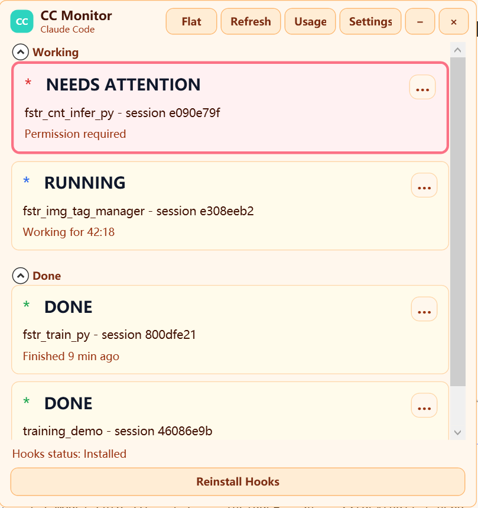

# CC Monitor

[简体中文](README.md) | [English](README.en.md)

CC Monitor 是一个面向 Claude Code 的 Windows 桌面监控器。它把多个终端中的会话集中到一个悬浮窗口，显示工作、等待操作、完成、中断、错误和可能失联等状态；点击会话还可以回到对应的 VS Code 窗口和终端。



## v0.4.2 主要能力

### 多会话状态监控

- 实时汇总多个 Claude Code 会话，并按状态分组或平铺显示。
- 区分 `RUNNING`、`NEEDS ATTENTION`、`DONE`、`INTERRUPTED`、`ERROR` 和 `STALE`，避免把所有停止都显示成错误。
- 用户按 `Ctrl+C` 或 `Esc` 中断后，即使 Stop Hook 没有及时送达，也会从本地 transcript 识别中断标记并更新状态。
- `/clear`、新会话和在另一个终端中 resume 旧会话按 session 与 terminal 身份分别维护，减少同一 cwd 下的会话混淆。
- 会话完成时可以闪烁、播放提示音或发送 Windows 通知；支持改名、隐藏和移除历史会话。
- Usage Dashboard 展示 Claude Code 在本地提供的用量、成本和上下文数据。

### 精确定位 VS Code 窗口与终端

- 每个 VS Code 窗口由 Terminal Bridge 主动登记 workspace、终端 PID、cwd、稳定 token 和当前活动终端；CC Monitor 不再依赖 Hook 进程树猜测 terminal PID。
- 窗口选择和终端选择是两阶段过程。扩展先选中目标 terminal，桌面端再将目标 VS Code 窗口提到前台。
- 同一 workspace、同一 cwd 存在多个 terminal 或 session 时，优先使用显式绑定和稳定 token，无法唯一确定时明确返回未匹配，不会随意选择第一个 VS Code 窗口。
- VS Code 没有公开窗口聚焦命令时会使用 Win32 fallback。聚焦前后保持原窗口几何状态：最大化仍最大化，普通窗口和 Snap 布局保持尺寸与位置，只有真正最小化的窗口才会恢复。
- Bridge 会区分 `matched`、`noMatch` 和 `bridgeNotRunning`，应用日志同时记录请求、匹配方式、目标 bridge 和窗口激活结果。

### 三种终端关联方式

匹配按可靠性从高到低进行：

1. **手动绑定**：在 session 菜单选择 **Bind terminal…**，然后在目标 VS Code terminal 中执行 **CC Monitor: Bind Active Terminal to Session**。
2. **稳定 terminal token**：执行 **CC Monitor: Create Managed Claude Terminal** 创建 tokenized terminal；token 属于 terminal，不依赖会变化的 Claude session ID。
3. **安全 cwd/workspace 匹配**：兼容已有 terminal，支持精确 cwd 以及受 workspace 边界约束的最近父子目录匹配；只有结果唯一时才切换。

如果要把已有 terminal 迁移为 tokenized terminal，可执行 **CC Monitor: Migrate Active Terminal**。扩展会在相同 cwd 创建替代 terminal 并启动 Claude，原 terminal 保持打开。

### Hook 与本地数据安全

- Hook payload 使用容错解析；单个格式异常不会让 Claude Code 持续显示 Hook error。
- Hook 状态采用文件锁和原子写入，降低多个进程同时更新同一 session 时的竞争。
- Hook 内部失败默认仍以退出码 `0` 结束，不阻塞 Claude Code 工作流。
- 原始 Hook payload 默认不保存。日志只记录结构诊断和哈希；仅在显式设置 `CCMONITOR_DEBUG_HOOKS=1` 时保存调试 payload。
- 所有 session、bridge、binding、usage 和日志数据都保存在 `%USERPROFILE%\.cc-monitor`，不会上传到服务器。

## 下载与安装

可从 [Gitea Releases](https://gitea.lan.fasteurai.com/linruyue/claude-code-monitor-desktop/releases) 或 [GitHub Releases](https://github.com/LornaCc/claude-code-monitor/releases) 下载 `CCMonitor-v0.4.2-win-x64.zip`。

发布包为 Windows x64 自包含版本，无需另外安装 .NET Runtime 或 Node.js。

1. 完整解压 ZIP，不要直接在压缩包预览中运行。
2. 双击 `Install-CCMonitor.cmd`。
3. 等待安装器报告成功。
4. 在每个已打开的 VS Code 窗口执行 **Developer: Reload Window**。
5. 推荐执行 **CC Monitor: Create Managed Claude Terminal**，再从该 terminal 使用 Claude Code。

安装器会停止所有旧 CC Monitor 实例，将 v0.4.2 安装到 `%LOCALAPPDATA%\Programs\CCMonitor\0.4.2`，重新指向 Claude Code Hooks 和 StatusLine，强制安装并核对 Terminal Bridge 0.4.2，更新开始菜单和桌面快捷方式，然后只启动新版本。旧版本目录可以保留用于兼容尚未重载的 Claude Code 进程，但安装器管理的 Hook、快捷方式和运行进程都会指向新版。

仅需重新安装 Hooks 时，可以在应用 Settings 中选择 **Reinstall Hooks**，或执行：

```powershell
PowerShell -ExecutionPolicy Bypass -File .\install-hooks.ps1 `
  -AppPath "C:\Path\To\CCMonitor.App.exe"
```

## 状态说明

| 状态 | 含义 |
| --- | --- |
| `IDLE` | 会话已登记，正在等待任务 |
| `RUNNING` | Claude 正在工作 |
| `NEEDS ATTENTION` | 等待权限、工具确认或用户操作 |
| `DONE` | 本轮工作完成，等待下一次输入 |
| `INTERRUPTED` | 用户通过 `Ctrl+C`、`Esc` 等方式主动中断 |
| `ERROR` | Claude 或 Hook 流程意外失败 |
| `STALE` | 一段时间没有新事件；进程可能已经结束或 Hook 未送达 |

`STALE` 是界面推断状态，不会覆盖磁盘中的最后一个真实 Hook 状态。默认阈值可以在 Settings 中调整。

## 本地架构

```text
Claude Code Hooks / StatusLine
        -> CCMonitor.Hook.exe / CCMonitor.StatusLine.exe
        -> %USERPROFILE%\.cc-monitor\sessions
        -> CCMonitor.App.exe

VS Code Terminal Bridge (每个窗口一个注册项)
        -> %USERPROFILE%\.cc-monitor\terminal-bridges
        <-> focus request / result
        -> 目标 terminal + 目标 VS Code window
```

常用诊断位置：

- 应用日志：`%USERPROFILE%\.cc-monitor\logs\cc-monitor-app.log`
- Hook 日志：`%USERPROFILE%\.cc-monitor\logs\cc-monitor-hook.log`
- StatusLine 日志：`%USERPROFILE%\.cc-monitor\logs\cc-monitor-statusline.log`
- VS Code：**Output → CC Monitor Terminal Bridge**

## 故障排查

- **Terminal Bridge is not running**：确认扩展为 0.4.2，并在每个相关 VS Code 窗口执行 **Developer: Reload Window**。
- **Terminal not found**：先激活正确 terminal，再使用 session 的 **Bind terminal…** 和 VS Code 的 **Bind Active Terminal to Session**。
- **同一 cwd 有多个 terminal**：使用 Managed Terminal 或手动绑定；CC Monitor 不会在歧义情况下随机切换。
- **状态没有变化**：在 Claude Code 中检查 `/hooks`，并查看 Hook 和 StatusLine 日志。
- **Hook 报 `InvalidJson`**：重新安装最新 Hooks；只有在可以接受本地保存原始 payload 时才启用 `CCMONITOR_DEBUG_HOOKS=1`。
- **窗口没有到前台**：检查 App 日志中的 `bridgeWindowFocused`、`windowActivated`、`windowInitialState` 和 `windowRestoreInvoked`。
- **移动了安装目录**：重新安装 Hooks；推荐直接重新运行 `Install-CCMonitor.cmd`。

## 从源码构建

需要 .NET 8 SDK、Node.js 和 PowerShell：

```powershell
dotnet test .\CCMonitor.sln -c Release
PowerShell -ExecutionPolicy Bypass -File .\scripts\build-release.ps1
```

脚本会运行 .NET 与 Terminal Bridge 测试，并在 `artifacts` 中生成自包含应用、Hook、StatusLine、VSIX、一键安装器和 ZIP。

## License

[MIT](LICENSE)
